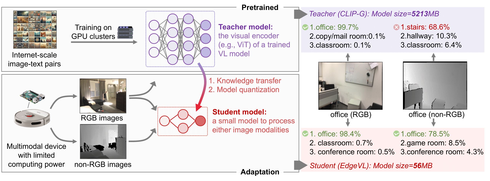

**Self-Adapting Large Visual-Language Models to Edge Devices across Visual Modalities**
<br/>
[Kaiwen Cai](https://scholar.google.com/citations?view_op=list_works&hl=en&hl=en&user=8T6VF-gAAAAJ), [Zhekai Duan](), [Gaowen Liu](https://scholar.google.com/citations?user=NIv_aeQAAAAJ&hl=en), [Charles Fleming](), [Chris Xiaoxuan Lu](https://christopherlu.github.io/)
<br/>


[](https://arxiv.org/abs/2403.04908)
[](https://www.youtube.com/watch?v=2E2XEPTFOKE&ab_channel=KaiwenCai)

<p align="left">

</p>

<p align="left">

</p>

## News
 - [2024-03-15] Our preprint paper is available on  [arXiv](https://arxiv.org/abs/2403.04908).
 - [2024-07-02] Our paper is accepted by [ECCV 2024](https://eccv2024.ecva.net/). 🎉
 - [2024-07-20] Training and testing code is released.


## Dataset
👉 [To prepare the dataset](./docs/prepare_dataset.md)

## Environment
👉 [To install the environment](./docs/install_envs.md)

## Train

Our EdgeVL consists of two stages:

```
# Stage1
DATASET=eurosat; CONFIG=swint_mix; QUANT_CONFIG=disable
python run.py --phase=train --config=configs/${DATASET}/${CONFIG}.yaml --quant_config=quantization_configs/${QUANT_CONFIG}.yaml

# Stage 2 
DATASET=eurosat; CONFIG=swint_mix_ctrs; QUANT_CONFIG=jacob
python run.py --phase=train_ctrs --config=configs/${DATASET}/${CONFIG}.yaml --quant_config=quantization_configs/${QUANT_CONFIG}.yaml 
```

## Evaluate
```
RUN_NAME=[run_name]; QUANT_CONFIG=jacob; TEST_MODAL=depth
python run.py --phase=test --run_name=${RUN_NAME} --quant_config=quantization_configs/${QUANT_CONFIG}.yaml --test_modal=${TEST_MODAL} --static_or_dynamic=static 
```

## Inference with a Pretrained Model
You might want to download the pretrained weights from Hugging Face:
```
cd edgevl
git lfs install
git clone https://huggingface.co/ramfais/edgevl_weights
mkdir logs && mv edgevl_weights/* logs
```

Then select a model for inference by setting `RUN_NAME=datt_scannet|datt_eurosat|swint_scannet|swint_eurosat|vits_scannet|vits_eurosat`
```
RUN_NAME=datt_scannet; QUANT_CONFIG=jacob; TEST_MODAL=depth
python run.py --phase=test --run_name=${RUN_NAME} --quant_config=quantization_configs/${QUANT_CONFIG}.yaml --test_modal=${TEST_MODAL} --static_or_dynamic=static 
```


## Deployment
👉 [To deploy on edge devices](./docs/deploy.md)


## Citation
```
@inproceedings{cai2024selfadapting,
    author = {Cai, Kaiwen and Duan, Zhekai and Liu, Gaowen and Fleming, Charles and Lu, Chris Xiaoxuan},
    booktitle = {European {Conference} on {Computer} {Vision} ({ECCV})}, 
    year = {2024},
    pages = {},
    publisher = {},
    title = {Self-{Adapting} {Large} {Visual}-{Language} {Models} to {Edge} {Devices} across {Visual} {Modalities}},
}
```